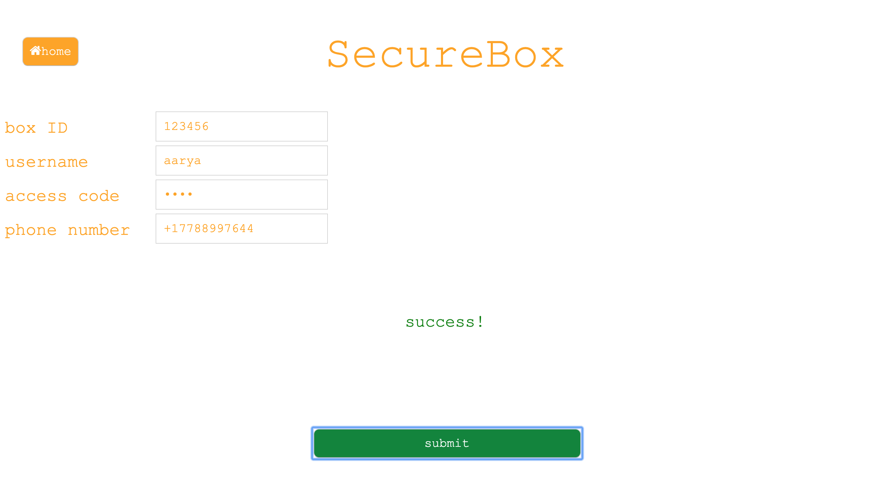
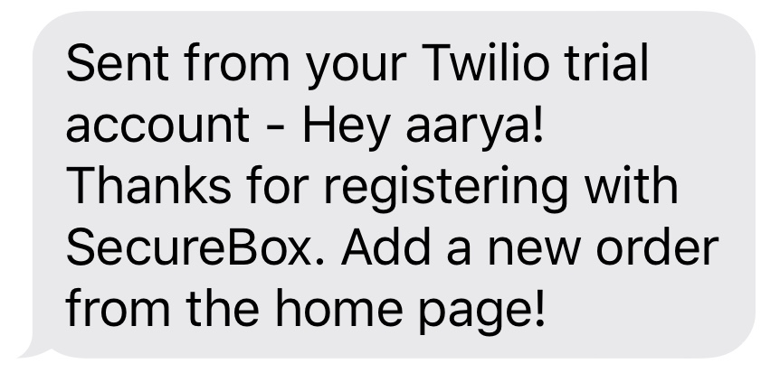
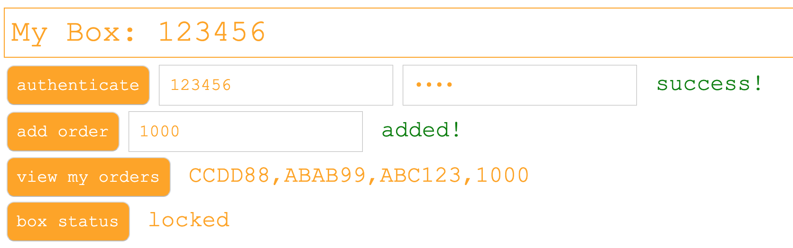
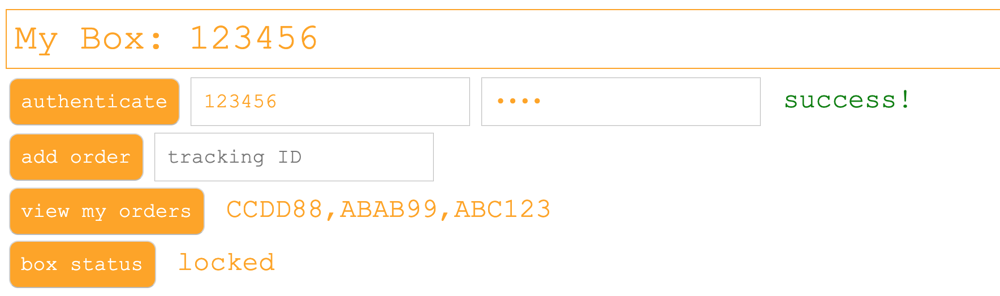
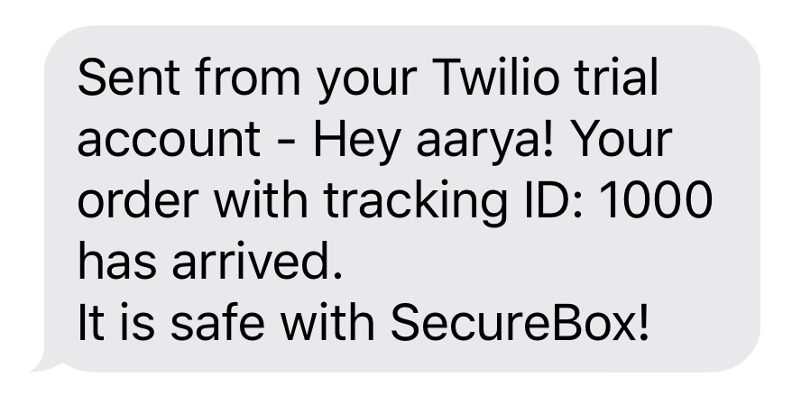
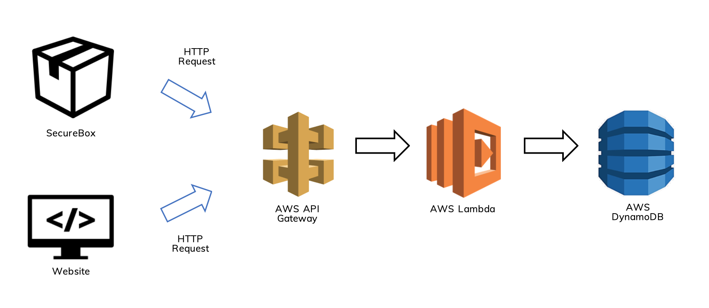

# SecureBox
## What is SecureBox?
SecureBox is the solution to two major problems with online delivery:
1. Theft of packages when customers are away from home
2. Travelling to a far away depot to pick up a package when it is rerouted 

SecureBox is an intelligent storage system for mail. It locks parcels received via mail for you, ensuring your mail is safe, and right outside your doorstep.

There are only two people who can open the box:
1. Customer - by entering the access code
2. Delivery man - by entering the tracking ID of an expected order 

All you have to do is add the tracking ID through the [website](https://aakarsharya.github.io/SecureBox/) when you make an order, so that the box knows what tracking ID to expect. When the order arrives, the box will delete the item from your list of orders and text you to let you know your order has arrived.

## How it Works
First, after purchasing the box, register through the [website](https://aakarsharya.github.io/SecureBox/register.html).
<br/><br/>
<p float="left">
  
   
</p>
Then, add the tracking ID of an order you are expecting.
<br/><br/>
<p float="left">
   
</p>
Now, when your arrives, the delivery man can open the box with the tracking ID. 
<br/><br/>

Once it arrives, you will receive a text, and your order will be removed from our database.
<br/><br/>
<p float="left">
   &nbsp;&nbsp;&nbsp;&nbsp;
   
</p>

## Behind the Scenes
SecureBox uses Amazon Web Services (AWS) to store users' data, and route requests from both the Rasberry Pi and the website.
 

AWS API Gateway is used to make calls to the SecureBox REST API. This API is a collection of HTTP resources and methods that integrate with HTTP endpoints and expose methods in the AWS Lambda function. It acts as an interface for the website or Rasberry Pi to retrieve, update, or add data to the Database. The Rasberry Pi makes requests using the python Requests library, while the website uses HTTP POST requests. 

The API Gateway triggers backend python code which is stored on AWS Lambda, known as a Lambda function. The lambda function parses the JSON associated with the request and makes changes or queries the database depending on the request.

The database is hosted through AWS DynamoDB, which is a NoSQL based database. It stores the user's box ID as a primary key, along with an access code, orders (with corresponding tracking ID's), username, and phone number. 

## SecureBox Web App
The SecureBox [website](https://aakarsharya.github.io/SecureBox/) allows the customer to access and set personal information. In order to access or change personal information, the user must first authenticate themselves with their box ID and access code. 

Some of the website features include:
- Orders/Add Order
- Get Box Status (locked/unlocked)
- Reset Access Code
- Register (for new users) 

## Rasberry Pi Program
Each SecureBox uses a Rasberry Pi to connect to the Database, authenticate users, and control the hardware components on the box. The box comes with an LCD Display, LED lights, and a Keypad to enter the access code.

### Installation (if you have a Rasberry Pi with Hardware components)
First, clone the repository to your Desktop.
```bash
git clone https://github.com/aakarsharya/SecureBox.git
```
Next, clone this Freenove repo to your Desktop from this [link](https://github.com/Freenove/Freenove_Ultimate_Starter_Kit_for_Raspberry_Pi). After cloning, copy the following libraries into the SecureBox/box directory. This libraries are used by the box's keypad, lights, and LCD display.
```bash
git clone https://github.com/Freenove/Freenove_Ultimate_Starter_Kit_for_Raspberry_Pi.git
cp ~/Desktop/Freenove_Ultimate_Starter_Kit_for_Raspberry_Pi/Code/Python_Code/22.1.1_MatrixKeypad/Keypad.py ~/Desktop/SecureBox/box
cp ~/Desktop/Freenove_Ultimate_Starter_Kit_for_Raspberry_Pi/Code/Python_Code/20.1.1_I2CLCD1602/Adafruit_LCD1602.py ~/Desktop/SecureBox/box
cp ~/Desktop/Freenove_Ultimate_Starter_Kit_for_Raspberry_Pi/Code/Python_Code/20.1.1_I2CLCD1602/PCF8574.py ~/Desktop/SecureBox/box
```

### Running the program
To run the program, simply enter the following command into your Rasberry Pi's terminal from the box directory using the following commands.
```bash
cd ~/Desktop/SecureBox/box
python box.py
```
Follow the prompts from the LCD Display.

## Tech Stack
### Backend
- Python
- AWS APIGateway
- AWS Lambda
- AWS DynamoDB
- Chalice
- Twilio API

### Frontend
- Javscript (XMLHttpRequest)
- HTML
- CSS

### Rasberry Pi
- Python HTTP Requests API
- Rasberry Pi Freenove Libraries

### Debugging Tools
- Postman (to test API)
